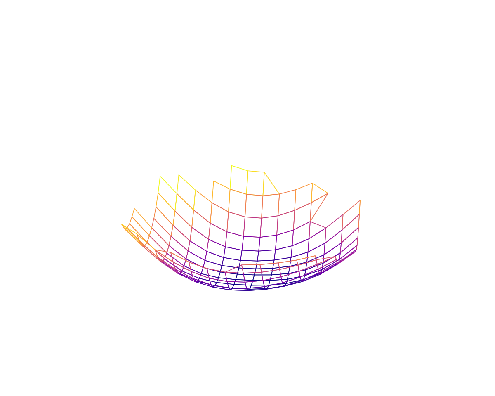

# how to install it ?
```bash
git clone https://github.com/shaoshitong/hdvw.git
cd hdvw
python setup.py build
python setup.py install
```

# how to use loss landscape visualization?

**draw loss landscape visualization**

#### firstly, Import related packages
```python
import sys
root = "."
sys.path.append(root)
import os
from omegaconf import OmegaConf as yaml
import copy
from pathlib import Path
import torch
from torch.utils.data import DataLoader
import hdvw.ops.tests as tests
from hdvw.models import load_snapshot
import hdvw.ops.loss_landscapes as lls
```
####  secondly, set config path
```python
config_path = {you config path}
with open(config_path) as f:
    args = yaml.load(f)
    print(args)
```
if you don't have a config file, you can set batchsize, lr and other parameters in the code.

#### thirdly, set dataset and model
```python
dataset_train, dataset_test= load_data_tinyimagenet(args['parameters']['batch_size'],
                                                           args['parameters']['batch_size'], args['data_url'])
from othermodel.efficientnet import effnetv2_s
model = effnetv2_s(num_classes=200)
```

#### fourthly, visual the relative output and set function
```python
num_classes = args["num_classes"]
print("Train: %s, Test: %s, Classes: %s" % (
    len(dataset_train.dataset),
    len(dataset_test.dataset),
    num_classes
))

from timm.data import Mixup

def mixup_function(train_args):
    train_args = copy.deepcopy(train_args)
    smoothing = train_args.get("smoothing", 0.0)
    mixup_args = train_args.get("mixup", None)

    mixup_function = Mixup(
        **mixup_args,
        label_smoothing=smoothing,
    ) if mixup_args is not None else None
    return mixup_function


transform = mixup_function({"smoothing":0.1})

map_location = "cuda" if torch.cuda.is_available() else "cpu"
```
#### fifthly, load model

```pytgon
checkpoint = torch.load({you checkpoint path}, map_location=map_location)
model.load_state_dict(checkpoint["state_dict"])
```

#### sixthly, get loss landscape
```python
import copy
import timm
import torch
import torch.nn as nn

scale = 1e-0
n = 21
gpu = torch.cuda.is_available()

metrics_grid = lls.get_loss_landscape(
    model, 1, dataset_train, transform=transform,
    kws=["pos_embed", "relative_position"],
    x_min=-1.0 * scale, x_max=1.0 * scale, n_x=n, y_min=-1.0 * scale, y_max=1.0 * scale, n_y=n, gpu=gpu,
)
uid=1
leaderboard_path = {your leaderboard path}
Path(leaderboard_path).mkdir(parents=True, exist_ok=True)
metrics_dir = os.path.join(leaderboard_path, "%s_%s_x%s_losslandscape.csv" % ('cifar10', uid, int(1 / scale)))
metrics_list = [[*grid, *metrics] for grid, metrics in metrics_grid.items()]
tests.save_metrics(metrics_dir, metrics_list)
```
#### seventhly, drawing graph
```python
import math
import numpy as np
import pandas as pd
import matplotlib.pyplot as plt
from matplotlib import cm

# load losslandscape raw data of ResNet-50 or ViT-Ti
names = ["x", "y", "l1", "l2", "NLL", "Cutoff1", "Cutoff2", "Acc", "Acc-90", "Unc", "Unc-90", "IoU", "IoU-90", "Freq", "Freq-90", "Top-5", "Brier", "ECE", "ECSE"]
# path = "%s/resources/results/cifar100_resnet_dnn_50_losslandscape.csv" % root  # for ResNet-50
path = metrics_dir
data = pd.read_csv(path, names=names)
data["loss"] = data["NLL"] + 1e-4 * data["l2"]  # NLL + l2

print(data['loss'])

# prepare data
p = int(math.sqrt(len(data)))
shape = [p, p]
xs = data["x"].to_numpy().reshape(shape)
ys = data["y"].to_numpy().reshape(shape)
zs = data["loss"].to_numpy().reshape(shape)

zs = zs - zs[np.isfinite(zs)].min()
zs[zs > 42] = np.nan

norm = plt.Normalize(zs[np.isfinite(zs)].min(), zs[np.isfinite(zs)].max())  # normalize to [0,1]
colors = cm.plasma(norm(zs))
rcount, ccount, _ = colors.shape

fig = plt.figure(figsize=(10, 8), dpi=120)
ax = fig.gca(projection="3d")
ax.view_init(elev=15, azim=5)  # angle

# make the panes transparent
ax.xaxis.set_pane_color((1.0, 1.0, 1.0, 0.0))
ax.yaxis.set_pane_color((1.0, 1.0, 1.0, 0.0))
ax.zaxis.set_pane_color((1.0, 1.0, 1.0, 0.0))
# make the grid lines transparent
ax.xaxis._axinfo["grid"]['color'] =  (1,1,1,0)
ax.yaxis._axinfo["grid"]['color'] =  (1,1,1,0)
ax.zaxis._axinfo["grid"]['color'] =  (1,1,1,0)

surf = ax.plot_surface(
    xs, ys, zs,
    rcount=rcount, ccount=ccount,
    facecolors=colors, shade=False,
)
surf.set_facecolor((0,0,0,0))

# remove white spaces
adjust_lim = 0.7
ax.set_xlim(-1 * adjust_lim, 1 * adjust_lim)
ax.set_ylim(-1 * adjust_lim, 1 * adjust_lim)
ax.set_zlim(0,20)
fig.subplots_adjust(left=0, right=1, bottom=0, top=1)
ax.axis('off')

plt.show()
```

lastly, we get the loss landscape:



# how to use confusion matrix?
```python
from hdvw.ops.confusion_matrix import confusion_matrix_pyplot
data,labels=test_dataset.data,test_dataset.labels
y_pred=model(data)
y_true=labels
confusion_matrix_pyplot(y_true,y_pred,name="./example.png")
```

## The code is copied form [how-do-vits-work](https://github.com/xxxnell/how-do-vits-work), thanks!
